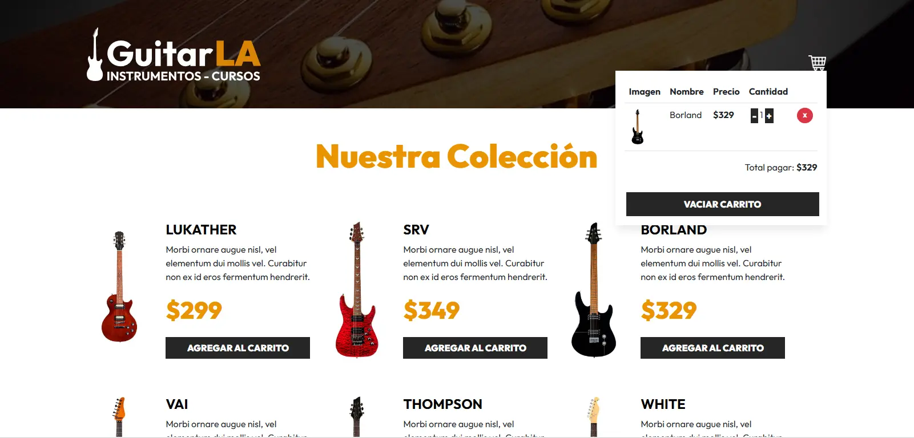

# GuitarLA

<p align="center">
  
</p>

GuitarLA es una tienda virtual de guitarras desarrollada con **React** y
**TypeScript**. Permite a los usuarios explorar una colección de guitarras,
agregarlas a un carrito de compras, modificar cantidades y simular una
experiencia de compra sencilla. El estado del carrito se mantiene persistente
usando **localStorage**.

## Características

- **Catálogo de guitarras:** Visualiza una lista de guitarras con imagen,
  nombre, descripción y precio.
- **Carrito de compras:**
  - Agrega guitarras al carrito.
  - Aumenta o disminuye la cantidad de cada guitarra (máximo 5, mínimo 1).
  - Elimina guitarras del carrito.
  - Vacía el carrito completamente.
- **Persistencia:** El carrito se guarda automáticamente en el navegador usando
  localStorage.
- **Cálculo automático:** El total a pagar se actualiza dinámicamente según el
  contenido del carrito.
- **Interfaz responsiva:** Utiliza Bootstrap para un diseño adaptable a
  diferentes dispositivos.

## Características de React y TypeScript Utilizadas

- **Componentes funcionales y tipados:** Toda la aplicación está construida
  usando componentes funcionales escritos en TypeScript, asegurando mayor
  seguridad y autocompletado.
- **Custom Hook tipado:**
  - `useCart`: Encapsula toda la lógica del carrito de compras, manejo de
    cantidades, persistencia en localStorage y cálculo de totales, con tipado
    estricto para facilitar su reutilización y mantenimiento.
- **Hooks de React:**
  - `useState`, `useEffect`, `useMemo` con tipado.
- **Props tipados:** Comunicación segura entre componentes usando interfaces de
  TypeScript para los props.
- **Renderizado condicional:** Para mostrar diferentes vistas según el estado
  del carrito.
- **Mapeo de listas:** Para renderizar dinámicamente la colección de guitarras y
  los productos en el carrito.

## Estructura del Proyecto

```
src/
│
├── components/
│   ├── Guitar.tsx      # Componente tipado para mostrar cada guitarra y agregarla al carrito
│   └── Header.tsx      # Encabezado tipado con logo y carrito de compras
│
├── data/
│   └── db.ts           # Base de datos local de guitarras (tipada)
│
├── hooks/
│   └── useCart.ts      # Custom hook tipado para la lógica del carrito de compras
│
├── types/
│   └── index.ts        # Definiciones de tipos e interfaces para tipar props y datos
│
├── App.tsx             # Componente principal, maneja el estado global y lógica del carrito
├── main.tsx            # Punto de entrada de la aplicación
└── index.ts            # Archivo de arranque principal
```

## Tecnologías Utilizadas

- **React** (con hooks: useState, useEffect, useMemo)
- **TypeScript** (tipado estricto en componentes, hooks y props)
- **Bootstrap** (para estilos y diseño responsivo)
- **localStorage** (para persistencia del carrito)

## Instalación y Uso

1. **Clona el repositorio:**

   ```bash
   git clone https://github.com/jempDev/guitarLA.git
   cd guitarLA
   ```

2. **Instala las dependencias:**

   ```bash
   npm install
   ```

3. **Inicia la aplicación:**

   ```bash
   npm run dev
   ```

4. Abre [http://localhost:5173](http://localhost:5173) en tu navegador.

## Personalización

- Puedes modificar el archivo `src/data/db.ts` para agregar, quitar o editar
  guitarras.
- Las imágenes de las guitarras deben estar en la carpeta `public/img/` y
  coincidir con el nombre definido en la propiedad `image` de cada guitarra.

## Beneficios de la Migración a TypeScript

- **Menos errores en tiempo de ejecución** gracias al tipado estático.
- **Mejor experiencia de desarrollo** con autocompletado y validación de props.
- **Código más mantenible y escalable**.

## Créditos

Desarrollado como parte de un curso de React + TypeScript en Udemy.

---

¡Explora, agrega guitarras a tu carrito y disfruta de la experiencia GuitarLA!
